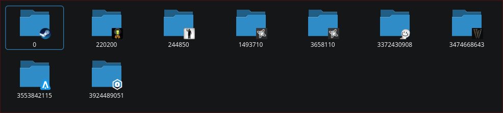

# Dolphin Steam Prefix Extension

A Dolphin plugin that improves the management of Steam prefixes for Dolphin. It adds context menu options to open the game in steam or the folder containing the game. It also displays the icon of the game on top of the folder icon.



## Features

- Adds context menu options to open the game in Steam or the folder containing the game.
- Displays the icon of the game on top of the folder icon.
- Works with Steam and Non-Steam games.
- Uses icon of executable for Non-Steam games and caches the icon for performance.

## Installation

This plugin is only packaged for nix. To install it you can use the flake provided in this repository. To install the plugin, add the following to your NixOS configuration:

```nix
{

  inputs = {
    nixpkgs.url = "github:NixOS/nixpkgs/nixos-unstable";
    dolphin-steam-prefix-extension = {
      url = "github:FelixSmtt/dolphin-steam-prefix-extension";
      inputs.nixpkgs.follows = "nixpkgs";
    };
  };

  outputs = { self, nixpkgs, dolphin-steam-prefix-extension }: {
    nixosConfigurations = {
      my-hostname = nixpkgs.lib.nixosSystem {
        system = "x86_64-linux";
        modules = [
          {
            environment.systemPackages = with pkgs; [
              kdePackages.dolphin
              inputs.dolphin-steam-prefix-extension.packages."x86_64-linux".default
            ];
          }
        ];
      };
    };
  };
}
```

## Building

To build the project for local development, you can use the provided `shell.nix` file to set up a Nix shell environment with all necessary dependencies. Follow these steps:

```bash
# Enter the nix-shell environment
nix-shell

# Run CMake to configure the build system
cmake .. -DCMAKE_INSTALL_PREFIX=../install_test -DCMAKE_INSTALL_LIBDIR=lib64

# Compile and install
make -j$(nproc) install
```

## License

This project is licensed under the MIT License. See the [LICENSE](LICENSE) file for details
